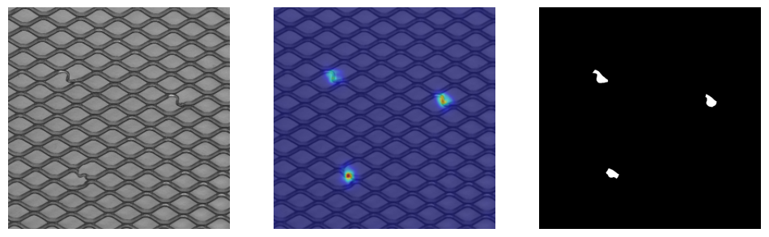

# Student-Teacher Feature Pyramid Matching for Anomaly Detection

This repository is an unofficial implementation of the network described in the paper [Wang, G., Han, S., Ding, E., & Huang, D. (2021). Student-Teacher Feature Pyramid Matching for Anomaly Detection. In The British Machine Vision Conference (BMVC)](https://arxiv.org/pdf/2103.04257.pdf).


## Dataset

You can download the dataset from [MVTec's official website](https://www.mvtec.com/company/research/datasets/mvtec-ad/).

## Usage

```python
pip install -r requirements.txt
python main.py --mode [train, test] --data_dir mvtec_anomaly_detection --category carpet --model_dir where/to/save/model
```

Run

```python
python main.py -h
```

For a full list of the possible arguments.

## Results (AUC score)

| Category   | Pixel (paper) | Image (paper) | Pixel (this code) | Image (this code) |
|------------|---------------|---------------|-------------------|-------------------|
| Carpet     | 0.988         | -             | 0.991             | 0.986             |
| Grid       | 0.990         | -             | 0.991             | 0.997             |
| Leather    | 0.993         | -             | 0.993             | 1.000             |
| Tile       | 0.974         | -             | 0.963             | 0.973             |
| Wood       | 0.972         | -             | 0.956             | 0.993             |
| Bottle     | 0.988         | -             | 0.986             | 1.000             |
| Cable      | 0.955         | -             | 0.947             | 0.936             |
| Capsule    | 0.983         | -             | 0.983             | 0.842             |
| Hazelnut   | 0.985         | -             | 0.987             | 1.000             |
| Metal nut  | 0.976         | -             | 0.975             | 0.998             |
| Pill       | 0.978         | -             | 0.976             | 0.948             |
| Screw      | 0.983         | -             | 0.987             | 0.913             |
| Toothbrush | 0.989         | -             | 0.987             | 0.883             |
| Transistor | 0.825         | -             | 0.811             | 0.992             |
| Zipper     | 0.985         | -             | 0.979             | 0.940             |
| Mean       | 0.970         | 0.955         | 0.967             | 0.955             |

## Result (localization)





